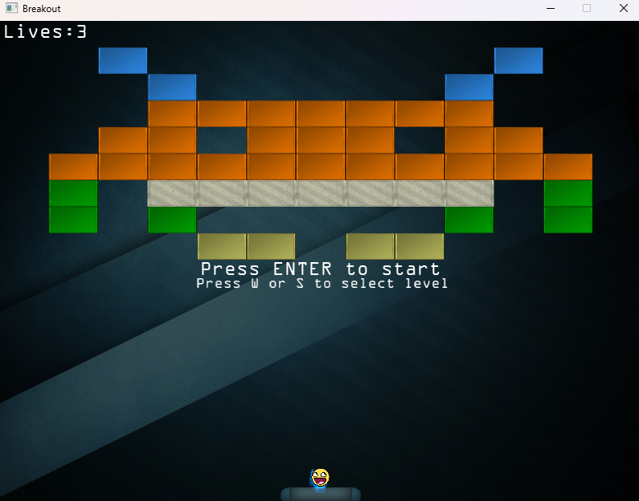
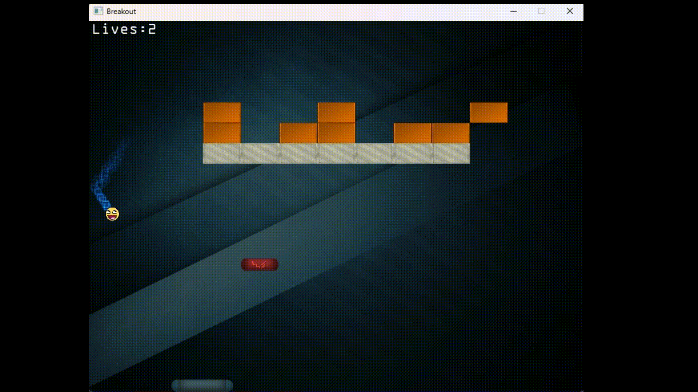

# 🧱 Breakout

A nostalgic, OG-style **Breakout** game built with **C++** and **OpenGL** using **Visual Studio**.  
This project is a tribute to the arcade classic that sparked my love for games as a kid.

---

## 🎮 About the Game

Breakout is a simple game where you control a paddle to bounce a ball and break bricks.  
This version is built entirely from scratch using modern OpenGL and C++, combining retro fun with modern rendering techniques.

I created this project because it reminded me of long hours spent playing the original Breakout on old machines.  
Rebuilding it from the ground up allowed me to explore graphics programming while reliving a piece of my childhood.

---

## 🛠️ Tech Stack

- **Language:** C++
- **Graphics API:** OpenGL (Modern)
- **IDE:** Visual Studio
- **Math:** GLM (OpenGL Mathematics)
- **Image Loading:** stb_image

---

## 🚀 Features

- 🧱 Classic Breakout mechanics  
- 🎨 Brick-breaking satisfaction with 2D OpenGL rendering  
- 🕹️ Keyboard input controls  
- 💥 Collision detection between ball, paddle, and bricks  
- 🧼 Clean and modular C++ code structure

---

## 📷 Screenshots



## 🎥 Gameplay Demo

  



---

## 🧾 Controls

| Key         | Action           |
|-------------|------------------|
| `← / A`     | Move paddle left |
| `→ / D`     | Move paddle right|
| `SPACE`     | Launch ball      |
| `ESC`       | Exit game        |

---

## 🧑‍💻 How to Build

### Prerequisites

- Visual Studio 2019 or later
- C++17 enabled
- GLFW
- GLEW
- GLM
- stb_image
- (Optional) OpenAL or any audio library

### Setup Instructions

1. Clone this repo:
   ```bash
   git clone https://github.com/slugoguls/Breakout.git
   
2. Open the `Breakout.sln` file in Visual Studio.

3. Make sure to configure your project with the correct include and library directories for the following dependencies:
   - **GLFW**
   - **GLEW**
   - **GLM**
   - **stb_image**

4. Link the necessary libraries in the project settings:
   - `opengl32.lib`
   - `glew32.lib`
   - `glfw3.lib`
   - *(Optional)* OpenAL libraries

5. Set your platform target to **x64** (if your libraries are 64-bit).

6. Build the project (`Ctrl + Shift + B`) and run it (`F5` or `Ctrl + F5`).

---

## 💡 Inspirations

- The original Atari Breakout (1976)
- [learnopengl.com](https://learnopengl.com) — for graphics fundamentals
- My own childhood memories of playing retro games

---

## 🙏 Acknowledgements

- [learnopengl.com](https://learnopengl.com)
- [stb_image](https://github.com/nothings/stb)
- [GLFW](https://www.glfw.org/)
- [GLM](https://github.com/g-truc/glm)

---

## 📌 Notes

- This project is **fully playable and complete**.
- However, I may add more features or polish certain aspects if I get the time.

Feel free to fork the repo, play around, and contribute if you'd like!

---

## 📃 License

This project is licensed under the **MIT License**.  
You are free to use, modify, and distribute it with proper attribution.

---
